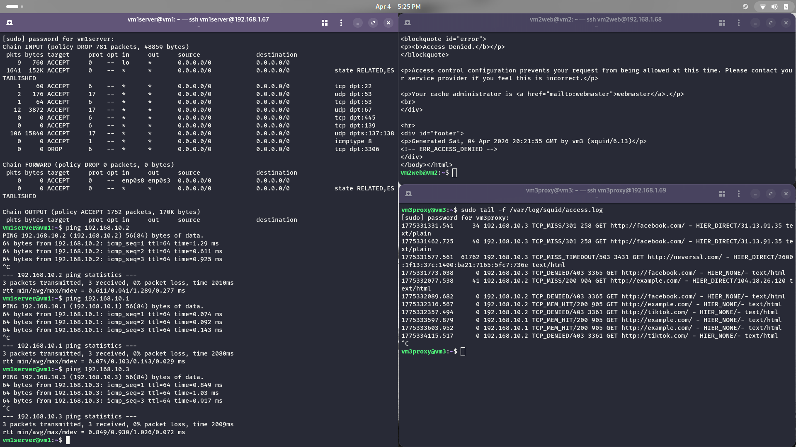
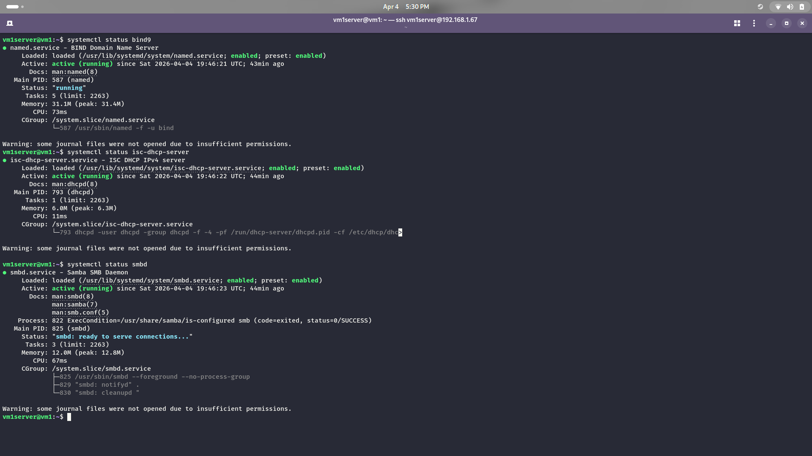
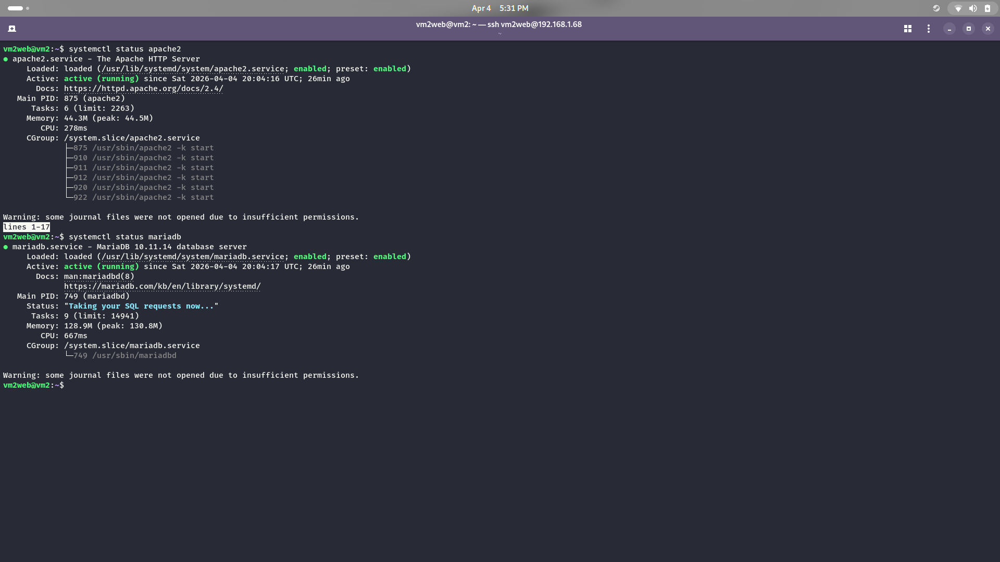
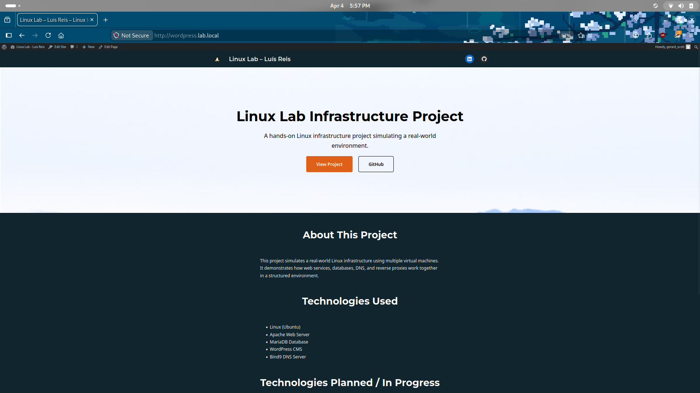
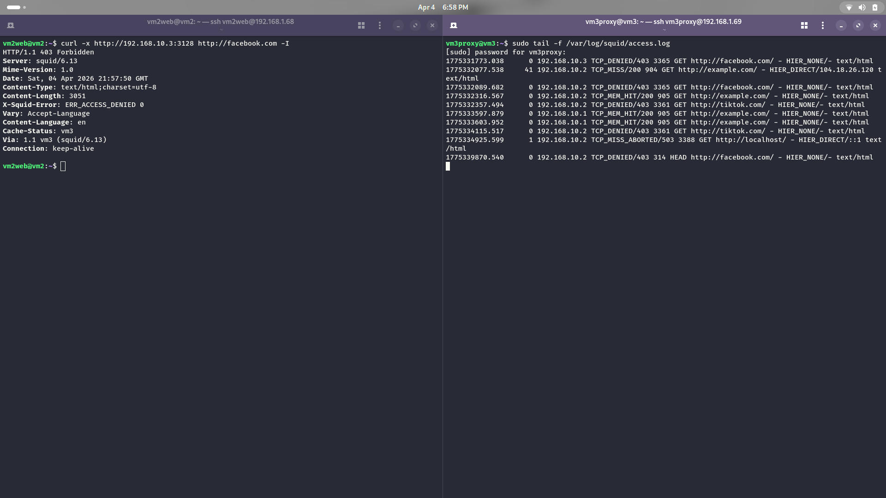
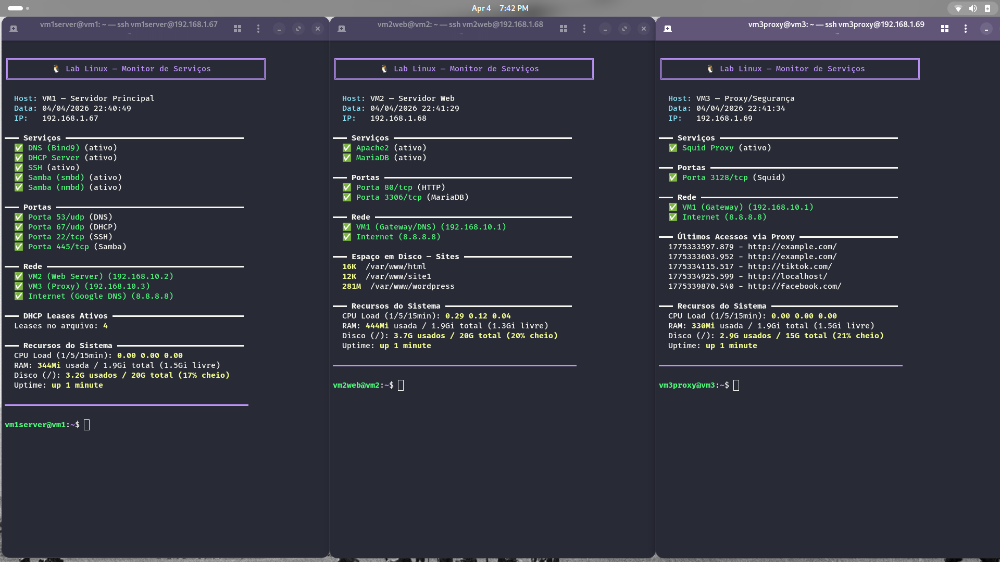
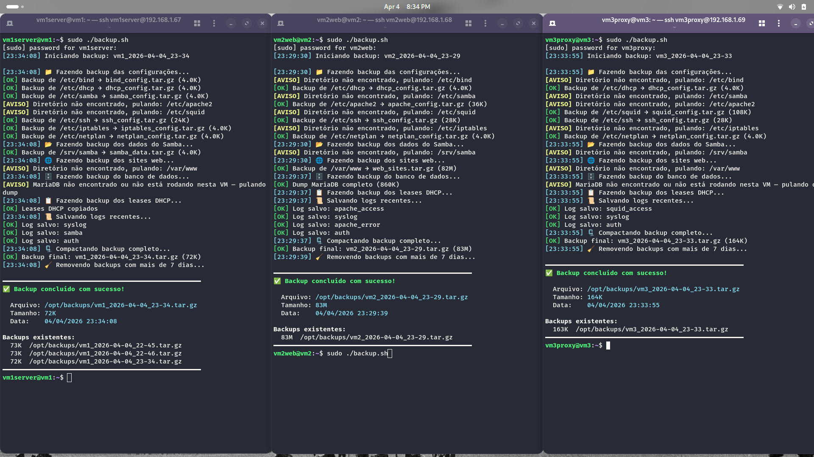

# Linux Infrastructure Lab

> A fully functional corporate network environment built from scratch on VirtualBox — three Ubuntu Server VMs, nine production-grade services, and real troubleshooting documented at every step.


---

## Overview

This project simulates a real corporate network infrastructure using virtual machines, demonstrating hands-on expertise in Linux system administration. The entire environment was built from scratch, documented step-by-step, and version-controlled.

| | |
|---|---|
| **Development Period** | April 2026 |
| **Environment** | VirtualBox 7.2 + Ubuntu Server 24.04 LTS |
| **Internal Network** | `192.168.10.0/24` |
| **Total VMs** | 3 |
| **Services Deployed** | 9 |

---

## Architecture

```
                        INTERNET
                            │
                    ┌───────┴────────┐
                    │  HOST (Fedora) │
                    │  VirtualBox    │
                    └───────┬────────┘
                            │ NAT
              ┌─────────────┼─────────────┐
              │             │             │
     ┌────────┴──────┐ ┌────┴──────┐ ┌───┴───────────┐
     │  VM1          │ │  VM2      │ │  VM3           │
     │  Core         │ │  Web      │ │  Proxy /       │
     │  Services     │ │  Server   │ │  Security      │
     │               │ │           │ │                │
     │ 192.168.10.1  │ │192.168.10.2│ │ 192.168.10.3  │
     │               │ │           │ │                │
     │ • DNS (Bind9) │ │ • Apache2 │ │ • Squid Proxy  │
     │ • DHCP        │ │ • WordPress│ │ • Monitoring   │
     │ • Firewall    │ │ • MariaDB │ │                │
     │ • SSH         │ │           │ │                │
     │ • Samba       │ │           │ │                │
     └───────────────┘ └───────────┘ └────────────────┘
              │                 │              │
              └─────────────────┴──────────────┘
                          Internal Network
                         192.168.10.0/24
```

### VM Roles

**VM1 — Core Services (`192.168.10.1`)**
The infrastructure backbone. Acts as DNS resolver, DHCP server, internet gateway (NAT), file server, and SSH access point for the entire internal network.

**VM2 — Web Server (`192.168.10.2`)**
Hosts the LAMP stack (Linux, Apache2, MariaDB, PHP) with a WordPress installation configured via virtual hosts.

**VM3 — Proxy / Security (`192.168.10.3`)**
Squid proxy server with content filtering, caching, and access control lists. All outbound HTTP traffic from the internal network is routed through this node.

---

## Services Deployed

| Service | VM | IP | Port(s) | Status |
|---|---|---|---|---|
| DNS (Bind9) | VM1 (Core Services) | 192.168.10.1 | 53 | ✅ |
| DHCP Server | VM1 (Core Services) | 192.168.10.1 | 67/68 | ✅ |
| SSH (hardened) | VM1 (Core Services) | 192.168.10.1 | 22 | ✅ |
| Samba | VM1 (Core Services) | 192.168.10.1 | 445 | ✅ |
| iptables Firewall + NAT | VM1 (Core Services) | 192.168.10.1 | — | ✅ |
| Apache2 | VM2 (Web Server) | 192.168.10.2 | 80 | ✅ |
| WordPress | VM2 (Web Server) | 192.168.10.2 | 80 | ✅ |
| MariaDB | VM2 (Web Server) | 192.168.10.2 | 3306 | ✅ |
| Squid Proxy | VM3 (Proxy) | 192.168.10.3 | 3128 | ✅ |

---

## Lab Topology

Each VM has two network adapters:

- **Adapter 1 (enp0s3):** NAT — provides internet access via the host machine
- **Adapter 2 (enp0s8):** Internal Network (`intnet`) — private communication between VMs

VM1 acts as the default gateway for VM2 and VM3 using `iptables MASQUERADE`, enabling internet access through the internal network interface. All DNS queries from VM2 and VM3 are resolved by Bind9 running on VM1.

DHCP is configured to serve addresses in the `192.168.10.100–200` range, with static reservations available via MAC address binding.

---

## Skills Demonstrated

- Linux server administration (Ubuntu Server 24.04 LTS)
- Network service configuration (DNS, DHCP, HTTP proxy)
- Network security (iptables, NAT, stateful firewall rules)
- Web application deployment (LAMP stack, WordPress)
- Cross-platform file sharing (Samba with user-based ACLs)
- Infrastructure troubleshooting (networking, services, connectivity)
- Shell scripting and automation (Bash)
- Professional technical documentation
- Version control with Git/GitHub

---

## Project Structure

```
linux-infrastructure-lab/
├── README.md                  # This file
├── INSTALL.md                 # Step-by-step installation guide
├── ARCHITECTURE.md            # Detailed architecture reference
├── TROUBLESHOOTING.md         # Common issues and solutions (runbook)
├── DISCLAIMER.md              # Environment scope and limitations
├── configs/
│   ├── bind/                  # DNS zone files and named.conf
│   ├── dhcp/                  # DHCP server configuration
│   ├── samba/                 # Samba shares and global config
│   ├── apache/                # Apache2 virtual host definitions
│   ├── squid/                 # Squid proxy config and blocklist
│   ├── iptables/              # Firewall rules script and saved rules
│   └── ssh/                   # Hardened sshd_config
├── scripts/
│   ├── setup/                 # Automated per-VM setup scripts
│   │   ├── vm1-setup.sh
│   │   ├── vm2-setup.sh
│   │   └── vm3-setup.sh
│   ├── backup.sh              # Automated config backup (all VMs)
│   ├── monitor.sh             # Service health monitoring
│   └── restart-services.sh    # Bulk service restart
└── docs/
    └── screenshots/           # Proof-of-function screenshots
```

---

## Getting Started

> This is a summary. For the full installation guide, see [INSTALL.md](./INSTALL.md).

**Prerequisites:** VirtualBox 7.x installed on a Linux host (tested on Fedora). Ubuntu Server 24.04 LTS ISO.

```bash
# 1. Clone the repository
git clone https://github.com/reisops/linux-infrastructure-lab.git
cd linux-infrastructure-lab

# 2. Run VM1 setup (Core Services) — execute as root
chmod +x scripts/setup/vm1-setup.sh
sudo ./scripts/setup/vm1-setup.sh

# 3. Run VM2 setup (Web Server)
sudo ./scripts/setup/vm2-setup.sh

# 4. Run VM3 setup (Proxy)
sudo ./scripts/setup/vm3-setup.sh
```

---

## Troubleshooting Philosophy

This lab was built with troubleshooting as a first-class concern — not an afterthought. Every service in this environment was tested to failure, diagnosed, and recovered.

The [TROUBLESHOOTING.md](./TROUBLESHOOTING.md) file is structured as a production runbook:

- **Symptom** — what you observe
- **Diagnosis** — commands to identify the root cause
- **Cause** — why it happens
- **Solution** — exact steps to resolve it

Documented failure scenarios include VirtualBox kernel module errors (Secure Boot conflicts), Bind9 zone syntax failures, DHCP interface binding issues, Samba authentication errors, Squid ACL ordering bugs, and iptables NAT misconfiguration.

---

## Evidence of Operation

### VM Network Communication



### VM1 — Core Services



### VM2 — Web Server




### VM3 — Squid Proxy



### Service Monitoring



### Automated Backup (all VMs)

The backup script detects which services are active on each VM and backs up only the relevant configurations — avoiding errors on nodes where a service is not installed.

- VM1 (Core Services): DNS, DHCP, Samba, firewall rules
- VM2 (Web Server): Apache2 virtual hosts, WordPress files, MariaDB dumps
- VM3 (Proxy): Squid configuration and access logs



---

## Author

**Luis Reis**
[LinkedIn](https://linkedin.com/in/luis-reis-ops) | [GitHub](https://github.com/reisops)

---

## Disclaimer

See [DISCLAIMER.md](./DISCLAIMER.md) for full details on environment scope and reproducibility.
